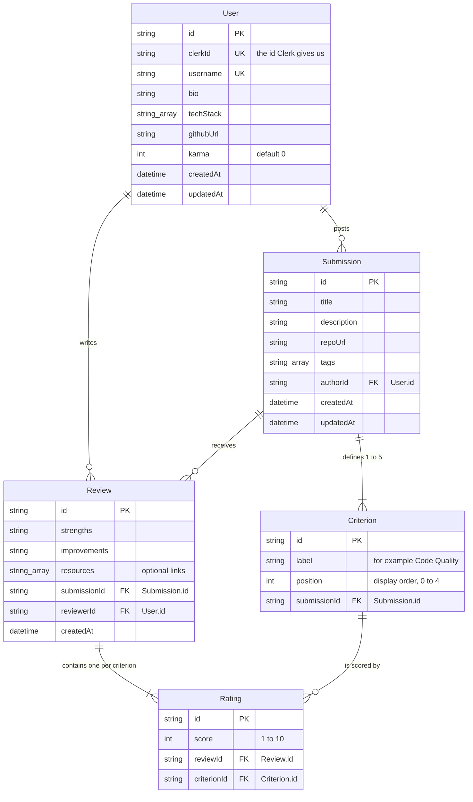

# Database design

Version 1, written 2026-08-11, before implementation.

The database is PostgreSQL, accessed through Prisma. Everything the platform stores is one of
five tables.

---

## 1. The tables at a glance

| Table | Holds one of | Why it exists |
| --- | --- | --- |
| `User` | A person | The account, the profile, and the Karma total |
| `Submission` | A review request | The thing being reviewed |
| `Criterion` | One thing to be scored | The poster invents these, so they cannot be a fixed list |
| `Review` | One person's feedback | The written half of a review |
| `Rating` | One score out of 10 | The numeric half of a review, one row per criterion |

---

## 2. Entity relationship diagram

---

## 3. Table detail

### User

| Column | Type | Rules |
| --- | --- | --- |
| `id` | String, cuid | Primary key. Our own id, not Clerk's. |
| `clerkId` | String | Unique. Links this row to the Clerk identity. |
| `username` | String | Unique. Used in the profile URL `/profile/:username`. |
| `bio` | String, optional | Free text. |
| `techStack` | String array | For example `["React", "Next.js", "Tailwind"]`. Drives the ranking in Feature 01. |
| `githubUrl` | String, optional | Link to the person's GitHub. |
| `karma` | Int, default 0 | Goes up by exactly 2 per review written. Never goes down. |
| `createdAt` | DateTime | Set automatically. |
| `updatedAt` | DateTime | Set automatically. |

### Submission

| Column | Type | Rules |
| --- | --- | --- |
| `id` | String, cuid | Primary key. |
| `title` | String | Required, not empty. |
| `description` | String | Required, not empty. What feedback the poster wants. |
| `repoUrl` | String | Required, must be a valid URL. |
| `tags` | String array | At least one tag. Matched against `User.techStack` for ranking. |
| `authorId` | String | Foreign key to `User.id`. |
| `createdAt` | DateTime | Drives both the logged out ordering and the recency part of the ranking. |
| `updatedAt` | DateTime | Set automatically. |

### Criterion

| Column | Type | Rules |
| --- | --- | --- |
| `id` | String, cuid | Primary key. |
| `label` | String | For example "Code Quality". Invented by the poster. |
| `position` | Int | Display order, 0 to 4, so criteria show in the order they were entered. |
| `submissionId` | String | Foreign key to `Submission.id`. Deleting is not part of this MVP, but the relation cascades for safety. |

Between 1 and 5 rows per submission. Enforced in the API, because a row count limit is not a
constraint SQL expresses cleanly.

### Review

| Column | Type | Rules |
| --- | --- | --- |
| `id` | String, cuid | Primary key. |
| `strengths` | String | Required. What was done well. |
| `improvements` | String | Required. What needs improving. |
| `resources` | String array | Optional helpful links. Can be empty. |
| `submissionId` | String | Foreign key to `Submission.id`. |
| `reviewerId` | String | Foreign key to `User.id`. |
| `createdAt` | DateTime | Set automatically. |

**Unique constraint on (`submissionId`, `reviewerId`).** This is what makes "one review per
person per submission" a guarantee rather than a hope. Even if two requests arrive at the same
instant, the database rejects the second one.

### Rating

| Column | Type | Rules |
| --- | --- | --- |
| `id` | String, cuid | Primary key. |
| `score` | Int | Between 1 and 10. Validated in the API. |
| `reviewId` | String | Foreign key to `Review.id`. |
| `criterionId` | String | Foreign key to `Criterion.id`. |

**Unique constraint on (`reviewId`, `criterionId`).** One score per criterion per review, no
duplicates.

---

## 4. Design decisions and why

### Karma is a column on User, not its own table

A separate `Karma` table would store one row per award, and the total would be a sum query on
every page load.

We chose an integer column because Karma is fixed at +2 per review and never decreases, so the
history adds nothing the `Review` table does not already record. If we ever needed an audit
trail, counting a user's reviews and multiplying by 2 reconstructs it exactly.

**The risk we accepted:** the column can drift out of step with reality if a review is ever
written without the Karma increment. We close that hole by writing the review, its ratings, and
the Karma increment inside a single database transaction. Either all of it happens or none of it
does.

### Status is derived, not stored

The spec has two statuses, Pending and Reviewed, and says the system updates them.

We do not store a status column. A submission with zero reviews is Pending, and one with one or
more reviews is Reviewed. It is computed by counting that submission's reviews.

**Why:** a stored status is a second copy of a fact the `Review` table already holds. Two copies
can disagree, and when they do the site shows something untrue. A derived value cannot disagree
with itself.

**The cost:** every feed query needs a review count. Prisma gives us this with `_count`, which
is a single grouped query, not one query per submission.

### Rating is its own table

The obvious shortcut is to put the scores on the `Review` row as a JSON blob. We did not.

Criteria are invented per submission, so the columns are not known ahead of time. A `Rating`
table with a foreign key to both `Review` and `Criterion` keeps the data queryable. It is what
makes "average score per criterion" or "which technologies does this person review in" a normal
SQL question instead of application code picking apart JSON.

### Tags and techStack are string arrays

PostgreSQL supports array columns natively and Prisma maps them to `String[]`.

The fully normalised alternative is a `Tag` table plus join tables. That is more correct in the
abstract, and it would matter if we needed tag renaming, tag merging, or tag popularity counts.
We need none of those. The array keeps the ranking query simple and keeps two extra tables out
of a system that four people have to explain individually.

### We store our own user id, not just the Clerk id

`clerkId` links the row to Clerk, but every foreign key in the system points at our own `id`.
That means if authentication ever changed, only one column would need attention rather than
every table.

---

## 5. Indexes

| Table | Index | Reason |
| --- | --- | --- |
| `User` | `clerkId` unique | Looked up on every authenticated request |
| `User` | `username` unique | Profile page lookups |
| `Submission` | `authorId` | Listing a user's own submissions |
| `Submission` | `createdAt` | The logged out feed sorts by this |
| `Review` | (`submissionId`, `reviewerId`) unique | Enforces one review per person per submission |
| `Review` | `reviewerId` | Counting reviews given on a profile |
| `Rating` | (`reviewId`, `criterionId`) unique | One score per criterion per review |

---

## 6. Rules the database cannot enforce

These live in the API. They are listed here so the two documents stay honest with each other.

| Rule | Where it is enforced |
| --- | --- |
| You cannot review your own submission | API, by comparing `submission.authorId` to the reviewer |
| Between 1 and 5 criteria per submission | API, by counting the incoming array |
| Every score is between 1 and 10 | API, before the write |
| Every criterion on the submission gets a score | API, by comparing the incoming scores to the submission's criteria |
| Title, description and repo URL are not empty, repo URL is a valid URL | API |
| At least one tag | API |
| Review plus ratings plus Karma succeed or fail together | API, inside a Prisma transaction |
