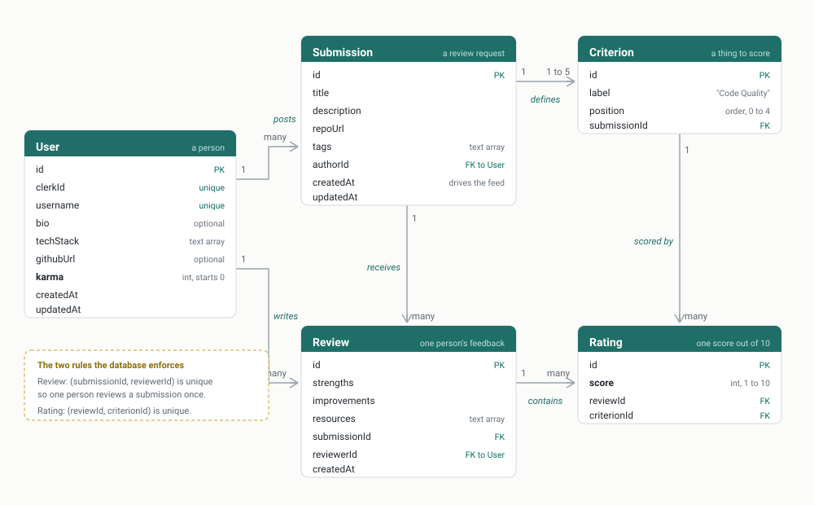

# CodeCritic team guide

Everything the four of us need, in one file. Read it once end to end before you touch anything.

Last updated 2026-08-12.

---

## Contents

1. [What we are building](#1-what-we-are-building)
2. [Are we following the SRS](#2-are-we-following-the-srs)
3. [What already exists](#3-what-already-exists)
4. [The database, and every decision behind it](#4-the-database-and-every-decision-behind-it)
5. [The API contract](#5-the-api-contract)
6. [What actually happens when someone clicks a button](#6-what-actually-happens-when-someone-clicks-a-button)
7. [Getting set up, from nothing](#7-getting-set-up-from-nothing)
8. [How we work on GitHub](#8-how-we-work-on-github)
9. [Who does what](#9-who-does-what)
10. [The plan to finish](#10-the-plan-to-finish)
11. [How this gets onto the internet](#11-how-this-gets-onto-the-internet)
12. [What every one of us must be able to explain](#12-what-every-one-of-us-must-be-able-to-explain)

---

## 1. What we are building

A website where developers post their code and ask other developers to critique it.

The plain version: imagine a noticeboard where people pin up their drawings and write underneath
"please tell me if the colours work and if the dog looks like a dog". Other people pin notes
back. Every note you write earns you a gold star.

Our drawings are GitHub repositories. Our gold stars are called **Karma**.

**The four things a person can do:**

1. Sign up, and fill in a profile: username, tech stack, bio, GitHub link
2. Post a review request: title, description, repo link, tags, and 1 to 5 things they want scored
3. Review someone else's request: what was done well, what needs improving, optional links, and a
   score out of 10 for each thing that person asked about
4. Browse the feed and read anyone's profile, without needing an account

Writing a review earns exactly **+2 Karma**. Nothing else changes it and it never goes down.

**What does not exist, and must not be built:** no admin, no moderator, no deleting, no editing
other people's things, no reporting, no notifications, no messaging. If you find yourself
building one of those, stop.

---

## 2. Are we following the SRS

Yes, with three places where we made a decision the SRS deliberately left to us. Those three are
the ones we will be questioned on.

| SRS requirement | What we are doing |
| --- | --- |
| Front end: Next.js, Tailwind, Shadcn/UI, Zustand | All four installed and running |
| Auth: Clerk | Installed on both halves, sign in works |
| Back end: Node + Express | Running |
| ORM: Prisma | Running |
| Database: SQL relational | PostgreSQL on Neon |
| Deployment: Vercel plus hosted back end and database | Vercel, Render, Neon. Section 11. |
| One shared repository | This one, front end and back end together |
| Public feed readable logged out | Our auth middleware identifies people without blocking anyone |
| Posting and reviewing require login | Enforced in the API, not just the UI |
| Karma fixed at +2 per review | Hard coded, no weighting |
| A user cannot edit another user's content | There is no route that can even be aimed at someone else. Section 5. |
| All input validated on the back end | Every rule listed in `docs/api-design.md`, enforced in Express |
| Karma cannot be obtained without a genuine review | Database constraint plus a single transaction. Section 4. |
| Responsive on mobile, tablet, desktop | Tailwind, and we test all three before submitting |
| All members contribute visibly | Branch per person, pull requests, reviews. Section 8. |
| Design documents produced before implementation | `docs/database-design.md` and `docs/api-design.md`, written and committed before the code |

### The three decisions the SRS left to us

**1. The SRS lists Karma as an entity. We made it a column, not a table.**

The SRS's own description of Karma is "a point total attached to each user". A total attached to
a user is a column. A separate table would hold one row per award, and since Karma is always +2
and never removed, every row would duplicate a `Review` row that already exists. If anyone ever
wants the history, counting a user's reviews and multiplying by two rebuilds it exactly.

**2. The SRS lists Pending and Reviewed as statuses. We do not store them.**

A submission with zero reviews is Pending. One with any reviews is Reviewed. We work it out by
counting. A stored status is a second copy of a fact the `Review` table already holds, and two
copies can disagree. A derived value cannot disagree with itself.

The SRS explicitly says the group decides how these are surfaced and must justify it. This is our
justification.

**3. We added a table the SRS does not name: Rating.**

The SRS requires "a rating for each criterion". That number has to live somewhere. It cannot be
columns on `Review`, because the criteria are invented per submission so the column names are not
known in advance. `Rating` holds one score, linked to one review and one criterion.

---

## 3. What already exists

Pushed to `main` and working:

**Database.** PostgreSQL 17 on Neon, hosted in Singapore. All five tables created by a migration
file that lives in the repo, so anyone can rebuild the identical database.

**Back end.** Express with TypeScript. Runs on port 4000. Connects to the database through
Prisma and answers real HTTP requests. Two endpoints exist so far: a health check and a bare
`GET /submissions` that returns whatever is in the table.

**Front end.** Next.js 16 with TypeScript, Tailwind 4, Shadcn/UI and Zustand. Runs on port 3000.
Clerk is wired in: sign in, sign up and the account menu all work.

**Documents.** `docs/database-design.md` and `docs/api-design.md`, both written before the code
as the SRS demands, plus this guide.

**What does not exist yet:** every real endpoint, every real page, seed data, the ranking engine,
and deployment. That is the rest of this document.

---

## 4. The database, and every decision behind it

Five tables. Everything on the site is one of these.



The same diagram written as text, which is easier to edit, is in `database-design.md`. If you
change the schema, change both.

### How to read that diagram

Each box is a table. The teal bar is its name, the rows underneath are its columns.

| Label | Meaning |
| --- | --- |
| PK | Primary key. The column that uniquely identifies a row. |
| FK | Foreign key. A column holding the id of a row in another table. This is how tables connect. |
| unique | No two rows may share this value. Two people cannot have the same username. |
| text array | A column holding a list, for example `["React", "Next.js"]` |

Every line between two boxes is a relationship, and the ends tell you how many:

- A plain end marked **1** means exactly one row.
- The branching end, called a crow's foot, marked **many**, means any number of rows including
  none.

So the top left line reads: one User posts many Submissions. A brand new user has posted nothing,
and that is still "many", because many includes zero.

The one exception is Submission to Criterion, marked **1 to 5**. Every submission must have at
least one criterion and at most five. That limit is enforced in the API rather than the database,
because a row count limit is not something SQL expresses cleanly. It is listed in section 5 with
the other validation rules.

The dashed yellow box is not a table. It is a reminder of the two rules the database itself
enforces, explained just below.

### Why PostgreSQL and not MySQL

`tags` on a Submission and `techStack` on a User are arrays of text. Prisma supports array columns
on PostgreSQL and not on MySQL. On MySQL we would need a `Tag` table plus two join tables, so
three extra tables, more queries, and more for four people to explain individually.

PostgreSQL keeps our design at five tables. That is the reason, and it is a good one to give.

### The two constraints that do the real work

```
@@unique([submissionId, reviewerId])   on Review
@@unique([reviewId, criterionId])      on Rating
```

The first is how we stop Karma farming. Our API checks whether you have already reviewed a
submission, but a check in code has a gap: if two requests arrive in the same millisecond, both
can pass the check before either has saved. The database has no such gap. It rejects the second
one no matter what.

The second means one score per criterion per review, no duplicates.

Both exist in the live database right now. You can prove it in the Neon SQL Editor:

```sql
SELECT indexname FROM pg_indexes WHERE tablename = 'Review';
```

### Why ids are random strings and not 1, 2, 3

We use `cuid()`, which produces a random unique string. Sequential numbers leak information:
anyone can see you have 47 users, and can guess that submission 12 exists and go looking at it.

### Why we store our own id as well as the Clerk id

`clerkId` links a row to Clerk. Every foreign key in the system points at our own `id`. If
authentication ever changed, one column would need attention instead of every table.

---

## 5. The API contract

Full detail with request bodies, response shapes and every error code is in
`docs/api-design.md`. This is the summary.

Base URL locally is `http://localhost:4000/api`.

| Method | Path | Auth | Purpose |
| --- | --- | --- | --- |
| GET | `/submissions` | Optional | The feed. Ranked when signed in, newest first when not. **This is Feature 01.** |
| GET | `/submissions/:id` | Optional | One request in full, with criteria, reviews and ratings |
| POST | `/submissions` | Required | Post a review request |
| POST | `/submissions/:id/reviews` | Required | Write a review and earn +2 Karma |
| GET | `/users/:username` | Optional | Public profile with insights. **This is Feature 02.** |
| POST | `/users/sync` | Required | Create or update our User row from the Clerk identity |
| PATCH | `/users/me` | Required | Edit your own profile |

### Three rules that apply to every endpoint

**Identity comes from the token, never from the body.** If a request body contains `authorId` or
`reviewerId` or `karma`, we ignore it. Otherwise anyone could post as anyone or hand themselves
points.

**Every error has the same shape**, so the front end only has to understand one thing:

```json
{ "error": { "code": "SELF_REVIEW_FORBIDDEN", "message": "You cannot review your own submission." } }
```

**There is no `PATCH /users/:id`.** The profile edit route is `/users/me` and has no id in it at
all, so there is no way to aim it at somebody else's row. That is the simplest possible answer to
the SRS rule that a user must not be able to edit another user's profile.

### The validation rules that carry marks

Mentors will call our API directly, outside our website. A check that lives only in a React form
is worth nothing. Every one of these lives in Express:

- Cannot review your own submission
- One review per person per submission
- Every criterion on the submission must get a score, no missing, no extra
- Every score is a whole number from 1 to 10
- Between 1 and 5 criteria per submission
- Title, description and repo URL not empty, repo URL a valid URL, at least one tag
- The review, its ratings and the +2 Karma are written in **one transaction**, so all three
  happen or none of them do

That last one is what makes the Karma total trustworthy. There is no path that produces Karma
without a stored review, and no path that stores a review without the Karma.

---

## 6. What actually happens when someone clicks a button

Worth understanding once, because every feature works the same way.

Say Aaysha submits a review.

1. **Her browser.** She fills the form on a Next.js page. React holds what she typed.
2. **Clerk.** The page asks Clerk for a signed token that proves she is her.
3. **The request.** The browser sends `POST /api/submissions/abc123/reviews` to our Express
   server, carrying the text, the scores, and that token in an `Authorization` header.
4. **Express checks everything.** Is the token real. Is she the author of this submission, which
   would be forbidden. Has she reviewed it before. Does every criterion have a score between 1
   and 10.
5. **Prisma writes.** Inside one transaction: create the Review, create every Rating, add 2 to
   her karma.
6. **PostgreSQL.** The rows are now permanent, in Singapore.
7. **Back to the screen.** Express answers with the created review and her new Karma total.
   Zustand updates the number in the navigation bar without reloading the page.

**Two ports, two programs.** The site runs on 3000, the API on 4000. They are separate programs
that talk over HTTP. That is why CORS exists: browsers block a page on one port from calling
another unless the server explicitly allows it.

**Where the ranking runs.** On the server, inside `GET /submissions`. Never in the browser. Two
reasons to give: the client cannot be trusted to sort honestly, and the database already holds
every value the formula needs.

---

## 7. Getting set up, from nothing

For Aqeel, Andrew and Aaysha. Roughly 20 minutes, most of it waiting for npm.

### Before you start

- **Node 22 or newer.** Check with `node --version`. If it is older, update it, nothing will work.
- **Git.** Check with `git --version`.
- Accept the GitHub organisation invitation if you have not.
- Ask Osini for two things, sent privately, never in the repo:
  - the `DATABASE_URL` for the back end
  - the two Clerk keys for the front end

### Step 1: clone the repository

```
git clone https://github.com/CodeCritic-StemLink/codecritic.git
cd codecritic
```

### Step 2: set up the back end

```
cd backend
npm install
```

Create a file called `.env` inside `backend` containing one line:

```
DATABASE_URL="the value Osini sent you"
```

Keep the quotes. That file is ignored by git and must never be committed.

Then:

```
npx prisma generate
```

**Do not skip that.** Prisma 7 writes the database client into `src/generated/prisma`, which is
not committed, so nothing compiles until you generate it on your own machine. Run it again any
time `prisma/schema.prisma` changes.

Start it:

```
npm run dev
```

Check http://localhost:4000/api/health in a browser. You should see:

```json
{"ok":true,"service":"codecritic-api"}
```

### Step 3: set up the front end

Open a **second** terminal, because the first one is now busy running the API.

```
cd frontend
npm install
```

Create a file called `.env.local` inside `frontend` containing:

```
NEXT_PUBLIC_CLERK_PUBLISHABLE_KEY=the pk_test_ key Osini sent
CLERK_SECRET_KEY=the sk_test_ key Osini sent
NEXT_PUBLIC_API_URL=http://localhost:4000/api
```

No quotes needed. No spaces around the equals signs.

**Anything named `NEXT_PUBLIC_` is sent to the browser and any visitor can read it.** That is
correct for the publishable key, which only identifies our Clerk application. Never put that
prefix in front of a secret.

Then:

```
npm run dev
```

Open http://localhost:3000. You should see a header saying CodeCritic with Sign in and Sign up
buttons. Click Sign up and make yourself an account to check it works.

### Every day after that

Two terminals, every time:

| Terminal | Folder | Command |
| --- | --- | --- |
| 1 | `backend` | `npm run dev` |
| 2 | `frontend` | `npm run dev` |

And before you start any work, always:

```
git checkout main
git pull
```

### Useful commands

| Command | Where | What it does |
| --- | --- | --- |
| `npx prisma studio` | `backend` | Opens a browser view of the database where you can read and edit rows |
| `npx prisma generate` | `backend` | Rebuilds the database client. Run after any schema change. |
| `npx prisma migrate dev` | `backend` | Applies new migrations to your database |
| `npx tsc --noEmit` | either | Checks for TypeScript errors without building. Run before every pull request. |

### If something breaks

| Symptom | Cause | Fix |
| --- | --- | --- |
| `Cannot find module './generated/prisma/client'` | You skipped generate | `npx prisma generate` in `backend` |
| `DATABASE_URL is missing` | No `.env`, or wrong folder | Create `backend/.env`, check you are in `backend` |
| Site loads but data never arrives | The API is not running | Start the second terminal |
| `Port 4000 is already in use` | An old server is still running | Close the other terminal, or restart |
| Clerk errors about a publishable key | `.env.local` missing or misspelt | Check the file name is exactly `.env.local`, inside `frontend` |
| A hydration error mentioning odd attributes | A browser extension edited the page | Not our bug. Try an incognito window. |

---

## 8. How we work on GitHub

Four people editing one repository. These rules exist so we never lose work and never block each
other.

### Nobody pushes to main. Ever.

`main` is the branch that must always work, because it is what gets deployed and what mentors
look at. All work happens on a branch and arrives through a pull request.

### Branch naming

```
yourname/what-you-are-doing
```

Examples:

- `andrew/review-endpoint`
- `aqeel/seed-script`
- `aaysha/submission-form`
- `osini/ranking-engine`

Your name first means anyone can see at a glance who owns what is in flight. Keep the second part
short and in lowercase with hyphens.

### The loop, every single time

```
git checkout main
git pull
git checkout -b yourname/what-you-are-doing
```

Do the work. Then:

```
git add .
git commit -m "Add the review endpoint with full validation"
git push -u origin yourname/what-you-are-doing
```

Then open a pull request on GitHub, ask someone to review it, and merge once approved.

In GitHub Desktop the same thing is: **Current branch**, then **New branch**, do the work, write
a summary, **Commit**, **Publish branch**, **Create Pull Request**.

### Commit messages

We use **Conventional Commits**. Every message starts with a type, a colon, then what the commit
does. The type tells a reader at a glance what kind of change it is, without opening the diff.

| Type | Use it when |
| --- | --- |
| `feat:` | You built something new that a user can see or use |
| `fix:` | You fixed a bug |
| `chore:` | Setup, config, dependencies. Not application code. |
| `style:` | Only formatting or CSS changed. Nothing behaves differently. |
| `refactor:` | You rewrote code but nothing looks different to a user |
| `docs:` | README, design documents, comments |
| `test:` | You added or changed tests |

You can add a scope in brackets when it helps say which area changed.

Real examples from this project:

```
feat: add the seed script with demo users and submissions
feat(reviews): block self reviews and duplicate reviews
feat(feed): rank submissions by the user's tech stack
fix: feed showing reviewed submissions as pending
chore: install express, prisma and clerk
docs: add the team guide and ER diagram
refactor: move the ranking maths into its own module
style: tidy the spacing on the submission card
```

Two rules on top of the type:

**Write it in the imperative**, as though completing the sentence "this commit will". So
`feat: add the review endpoint`, not `added the review endpoint` or `adding review endpoint`.

**The title is enough for small changes.** Add a description underneath when the why is not
obvious from the title, especially when you made a decision someone might question later.

**Commit small and commit often.** Our assessors look at the history to see that all four of us
actually contributed. One giant commit at 3am on the last day looks exactly like what it is.

### Reviewing someone else's pull request

Do not just click approve. Spend five minutes and check:

1. Does it do what the description says
2. Does the back end validate anything it accepts from a user
3. Are there any secrets, keys or passwords in the diff
4. Would you be able to explain this code if a mentor asked you about it tomorrow

That fourth one matters most. **We are each examined on the whole system, including parts we did
not write.** Reviewing pull requests is how you learn the parts you did not build. If you approve
something you do not understand, you are choosing to fail that question later.

If you do not understand a line, comment and ask. That is not rude, it is the point.

### When two people edit the same file

Git will complain about a conflict. Do not panic and do not delete anything. Pull `main` into
your branch, open the file, and you will see both versions marked. Keep what belongs, remove the
markers, commit. If it looks bad, ask in the group chat rather than guessing.

The best fix is prevention: we split the work by file, in section 9, so this should be rare.

---

## 9. Who does what

Split so nobody waits on anybody. Everything in a given column can be built at the same time.

### Aqeel: the profile and Feature 02

The seed data is already done, so you are not blocked and nobody is blocked by you.

**Your job:** `GET /users/:username`, which is Feature 02.

The profile returns tech stack, bio, GitHub link, Karma, the count of reviews given, the count of
reviews received, and at least one insight derived from real rows. The insights we agreed are in
`docs/api-design.md`: which technologies this person most often reviews in, their review activity
by month, and their average score given.

Two things that carry the marks here:

- **Every figure must be counted from the database**, never stored or hard coded. Karma is the
  one exception, and it is a column precisely because it is derivable.
- **You must be able to explain each query out loud.** "Reviews received" is the tricky one: it
  is not reviews where this person is the reviewer, it is reviews on submissions this person
  wrote. Make sure you can say why those are different.

**Files you own:** `backend/src/routes/users.ts`, the profile route only. Osini owns the sync
route in the same file, so keep to your half and pull `main` often.

### Andrew: the core API

The three endpoints that make the site work.

1. `GET /submissions/:id`, one request in full with criteria, reviews, ratings and author
2. `POST /submissions`, with all five validation rules
3. `POST /submissions/:id/reviews`, the important one

That third endpoint hands out points, so it is the one people will attack. Check things in this
order so the caller gets the most useful error:

1. Signed in, else 401
2. Submission exists, else 404
3. Reviewer is not the author, else 403
4. Reviewer has not already reviewed it, else 409
5. Text fields present and not too long
6. Ratings cover exactly the submission's criteria
7. Every score is a whole number 1 to 10
8. Then write the review, the ratings and the +2 Karma in **one transaction**

**Files you own:** `backend/src/routes/submissions.ts`, and any validation helpers.

### Osini: everything that blocks other people

The rule we agreed: **anything that blocks somebody else is Osini's job**, so the other three
never sit waiting.

1. **The seed script**, `backend/prisma/seed.ts`. Done, because without data everyone else is
   building against an empty screen.
2. `POST /users/sync`, which creates our `User` row the first time a Clerk identity appears. This
   is the gap between "signed in with Clerk" and "exists in our database", and nothing on the
   site works for a logged in user until it is closed. Aaysha is blocked on this.
3. The ranking engine, Feature 01, written as its own module at `backend/src/lib/ranking.ts` so
   Andrew's route can call it without either of you waiting for the other.
4. `GET /submissions`, the feed, using that module.
5. Deployment, section 11.
6. Keeping the documents in `docs/` true as things change.

**Files you own:** `backend/prisma/seed.ts`, `backend/src/lib/ranking.ts`, the feed route, the
sync route, `docs/`.

### Aaysha: the entire front end

Five pages, all against the agreed API contract. You do not need to wait for the endpoints to
exist, because the shapes are written down in `docs/api-design.md`.

1. **Feed**, `/`. The list of requests, with search and tag filters. Shows Pending or Reviewed,
   tags, author, review count.
2. **Request detail**, `/submissions/[id]`. Full description, the criteria, and every review with
   its scores.
3. **Post a request**, `/submissions/new`. Title, description, repo URL, tags, and criteria the
   user can add and remove, between 1 and 5.
4. **Write a review**, on the detail page or its own route. Strengths, improvements, optional
   links, and a score control for every criterion on that submission.
5. **Profile**, `/profile/[username]`. Tech stack, bio, GitHub link, Karma, counts, insights.

**Must be responsive on mobile, tablet and desktop.** That is an SRS requirement and it is easy
to check late and painful to fix late, so check as you go.

**Files you own:** everything under `frontend/src/app` and `frontend/src/components`.

### Shared, agree before writing

One person writes `frontend/src/lib/api.ts`, a small file holding the fetch calls and the base
URL, so we do not end up with four different ways of calling the API. Aaysha, since it is her
folder.

---

## 10. The plan to finish

Deadline is around 2026-08-15.

### Today, 12 August: everything works locally

| Who | Done means |
| --- | --- |
| Aqeel | Profile endpoint returning karma, both counts and the insights, all counted from real rows |
| Andrew | All three endpoints working, every validation rule enforced, tested by hand |
| Osini | `/users/sync` working, ranking module written and the feed reordering |
| Aaysha | Feed and detail pages rendering real data from the API |

**The seed data is already in the repository**, so everyone can start against realistic rows
immediately. Run `npm run seed` in `backend` after pulling.

### Tomorrow, 13 August: everything is connected

| Who | Done means |
| --- | --- |
| Aqeel | Profile endpoint attack tested, and the queries explainable out loud |
| Andrew | Every endpoint attack tested, section 12's list |
| Osini | Feed order visibly different per user, with a "why this order" view |
| Aaysha | All five pages working end to end, responsive on all three sizes |

### 14 August: deployed and rehearsed

Deploy all three parts, run through the whole site on the real URL, and every one of us walks the
entire system out loud to the other three. Not the part you wrote. The whole thing.

### 15 August: submit

Deployed link, repository link, design documents. Everyone submits from their own cohort.

---

## 11. How this gets onto the internet

Three separate things get hosted.

| Part | Host | Notes |
| --- | --- | --- |
| Database | Neon | Already live |
| Back end | Render | Free tier. Sleeps when idle and takes about 30 seconds to wake. |
| Front end | Vercel | Free tier |

### Back end on Render

Create a Web Service pointing at the repository, then:

| Setting | Value |
| --- | --- |
| Root directory | `backend` |
| Build command | `npm install && npx prisma generate && npm run build` |
| Start command | `npx prisma migrate deploy && npm start` |

Environment variables to set there: `DATABASE_URL`, `CLERK_SECRET_KEY`, `CLERK_PUBLISHABLE_KEY`,
and `CORS_ORIGIN` set to the Vercel URL once we have it.

**Two traps to expect.** First, `npx prisma generate` must be in the build command, because the
generated client is not committed. Skip it and the build succeeds locally and fails on Render
with "cannot find module". Second, `prisma migrate deploy` is what creates the tables on the live
database. It is a different command from `migrate dev` and does not try to create new migration
files.

### Front end on Vercel

Import the repository, then:

| Setting | Value |
| --- | --- |
| Root directory | `frontend` |
| Framework | Next.js, detected automatically |

Environment variables: `NEXT_PUBLIC_CLERK_PUBLISHABLE_KEY`, `CLERK_SECRET_KEY`, and
`NEXT_PUBLIC_API_URL` set to the Render URL plus `/api`.

### Order of operations, because these depend on each other

1. Deploy the back end to Render, get its URL
2. Deploy the front end to Vercel with `NEXT_PUBLIC_API_URL` pointing at that Render URL
3. Go back to Render and set `CORS_ORIGIN` to the Vercel URL
4. In Clerk, create the Production instance, add the Vercel domain, and swap the `pk_live_` and
   `sk_live_` keys into both hosts

Step 3 catches everyone. Without it the browser blocks every request and the site looks broken
with no obvious cause.

### Keeping it alive for the long term

The free tiers will not last forever. What makes this project revivable is that it uses plain
PostgreSQL through Prisma, so moving to any other host is one connection string. Before we
submit, we also export a SQL dump of the schema and demo data and commit it, so anyone can
rebuild the whole thing from the repository alone.

---

## 12. What every one of us must be able to explain

We are each examined individually on the **whole** system, including the parts we did not write.
Code you cannot explain or change on the spot earns nothing.

Practice answering these out loud. If you cannot, go and read that part of the code.

**About the data**

- Why five tables, and what each one holds
- Why Karma is a column and not a table
- Why Pending and Reviewed are not stored anywhere
- Why `Rating` exists when the SRS never mentions it
- Why PostgreSQL and not MySQL

**About trust and safety**

- How we stop someone reviewing their own submission
- How we stop someone reviewing the same submission twice, and why the database constraint matters
  more than the code check
- How we stop someone awarding themselves Karma by putting it in a request body
- What a transaction is and why the review, the ratings and the Karma are inside one
- Why a check in a React form is worth nothing

**About Feature 01, the flagship**

- The formula, and what each part contributes
- Why tag matching is weighted highest
- Why a post with no reviews gets a boost, and what problem that solves
- Why it runs on the server and not in the browser
- What happens to a post that matches every tag but is a year old
- What alternatives we considered and why we rejected them

**About the architecture**

- What Clerk does and what it does not do
- Why a Clerk account and a row in our `User` table are two different things
- What Prisma is, and what `prisma generate` produces
- Why the front end and back end run on different ports, and what CORS is for
- What happens between clicking submit and the row appearing in the database

### Before we submit, we run these attacks on our own API

Every one of them, by hand, and we keep the results:

1. `POST /submissions` with no token, expect 401
2. `POST /submissions` with an empty title, expect 400
3. `POST /submissions` with 6 criteria, expect 400
4. Review your own submission, expect 403
5. Review the same submission twice, expect 409 on the second
6. Send a score of 11, expect 400
7. Send a review missing one criterion, expect 400
8. Send `"karma": 9999` in a body and confirm it is ignored
9. After every failed attempt above, confirm the reviewer's Karma has not moved
